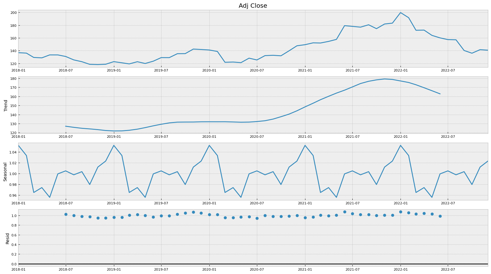
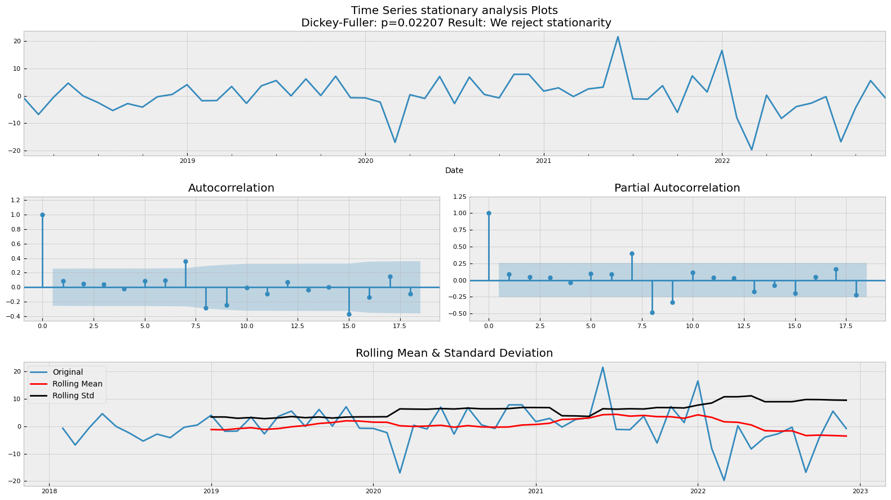
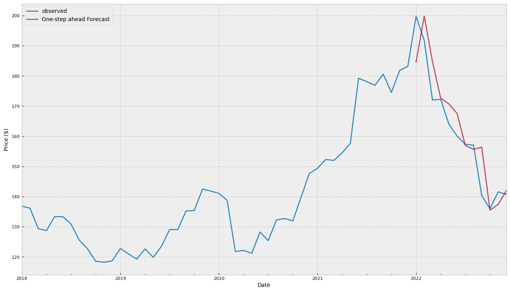
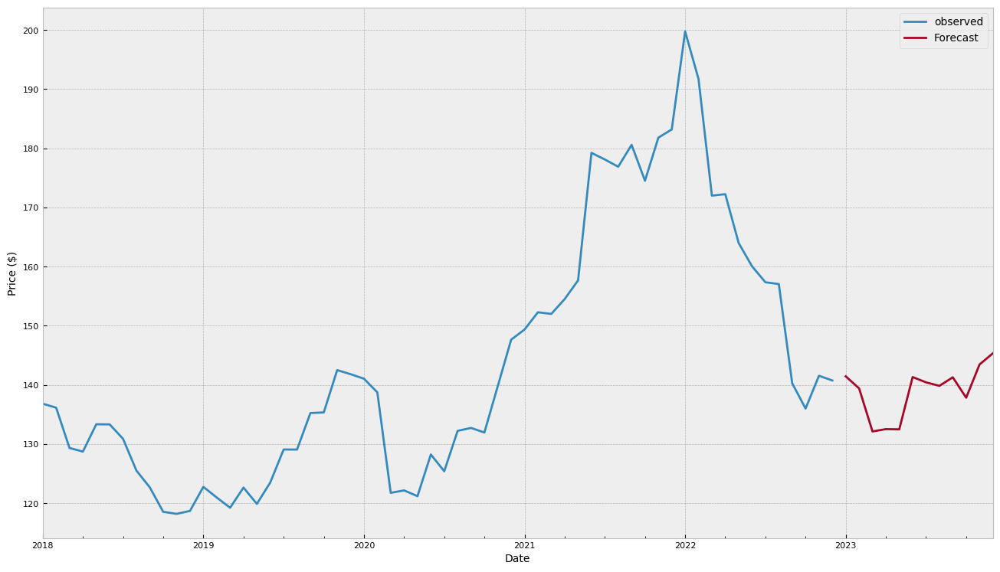
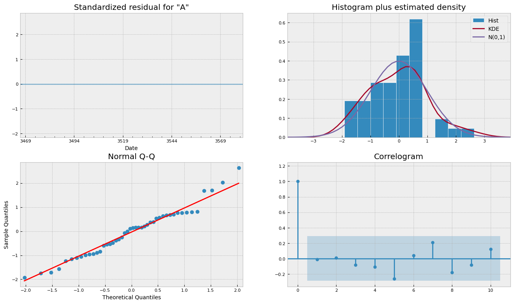

# ⏲️ Stock Price Analysis & Forecasting
This repository contains time series analysis and forecasting of a stock. A real dataset offers true insights in making a good prediction model, therefore, stock price data of Toyota Motors (TM) stock price data of 2018-2023 is used which is collected using `yfinance` module in python. `statsmodels` module provides all the tools and functions to compute the neccesary statistics to define the model.

| MODEL | MSE | RMSE |
|-|-|-|
|SARIMAX| 70.08 | 8.37 |

Access notebooks: [analysis](content/analysis.ipynb)  &  [forecast](content/forecasting.ipynb)

## Decomposition
The most common way to analyze your data is to decompose your time series. statsmodels provides a useful method `seasonal_decompose` that decomposes data into 4 different components namely level, trend, seasonality and residual(noise). Most of the time series are a combination these components.
- Additive model: `(level + trend + seasonal + residual)` In additive model, trend is linear, seasonality has constant frequency and amplitude.
- Multiplicative model: `(level*trend*seasonal*residual)` Tn multiplicative model, trend in non-linear, seasonality is not constant.



## Stationarity
Stationarity is an important charateristic of time series. Often, stock prices are not stationary. The trend may increase/decrease abruptly. Voltatlity is sensitive w.r.t time.To create a prediction model, we need the time series to be stationary. To check if the data is stationary or not, there are tests which can be performed like:
1. **Augmented Dickey-Fuller test**:
   - The Augmented Dickey-Fuller test is a type of statistical test called a unit root test. The intuition behind a unit root test is that it determines how strongly a time series is defined by a trend. There are a number of unit root tests and the Augmented Dickey-Fuller may be one of the more widely used. It uses an autoregressive model and optimizes an information criterion across multiple different lag values. The null hypothesis of the test is that the time series can be represented by a unit root, that it is not stationary (has some time-dependent structure). The alternate hypothesis (rejecting the null hypothesis) is that the time series is stationary.
   - p-value > 0.05: Fail to reject the null hypothesis (H0), the data has a unit root and is non-stationary.
   - p-value <= 0.05: Reject the null hypothesis (H0), the data does not have a unit root and is stationary.

2. **Auto-Correlation & Partial Auto-Correlation**:
   - Autocorelation plots show how correlated are values at time t with the next values in time t+1,t+2,..t+n. If the data would be non-stationary the autocorrelation values will be highly correlated with distant points in time showing possible seasonalities or trends.Stationary series autocorrelation values will quickly decrease over time t. This shows us that no information is carried over time and then the series should be constant over time.

3. **Rolling mean and Rolling std deviation**:
   - mean and standard deviation should be constant over time in order to have a stationary time series.
   


## Differencing
To make the data stationary we use differencing. Applying a difference transform to a time series could help remove the series dependence on time. This transform is done by substracting the previous obesvation to the current one. `difference(t) = observation(t) - observation(t-1)`

## SARIMA Model
Seasonal Autoregressive Integrated Moving Average, SARIMA or Seasonal ARIMA, is an extension of ARIMA that explicitly supports univariate time series data with a seasonal component. It adds three new hyperparameters to specify the autoregression (AR), differencing (I) and moving average (MA) for the seasonal component of the series, as well as an additional parameter for the period of the seasonality.

__Trend Elements:__ There are three trend elements that require configuration. They are the same as the ARIMA model, specifically:
- p: Trend autoregression order.
- d: Trend difference order.
- q: Trend moving average order.

__Seasonal Elements:__ There are four seasonal elements that are not part of ARIMA that must be configured; they are:
- P: Seasonal autoregressive order.
- D: Seasonal difference order.
- Q: Seasonal moving average order.
- m: The number of time steps for a single seasonal period. For example, an S of 12 for monthly data suggests a yearly seasonal cycle.

__SARIMA notation:__ SARIMA(p,d,q)(P,D,Q,m)

```python
model = sm.tsa.statespace.SARIMAX(y, order=(2,1,1), seasonal_order=(2,1,1,12))
```






